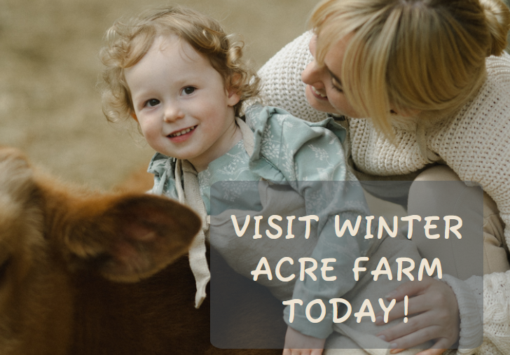
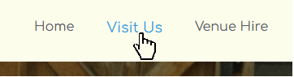
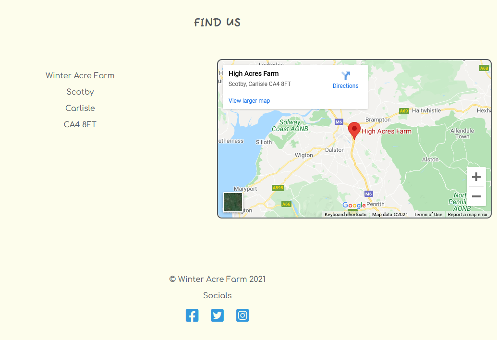
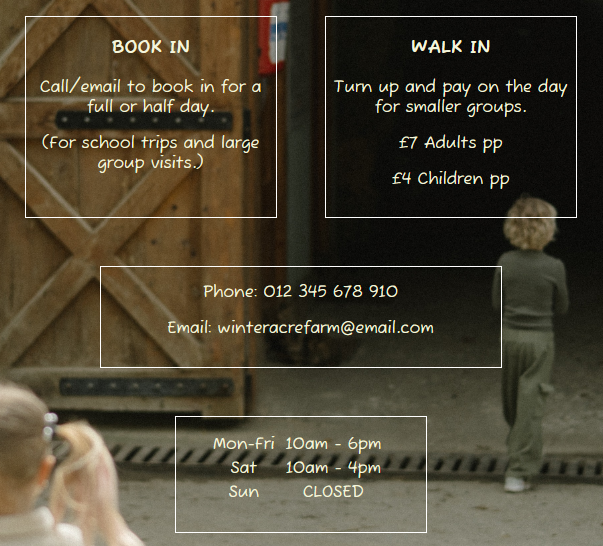
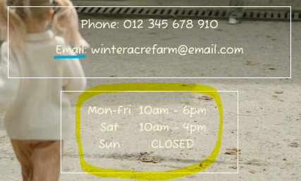

<h1 align=center> Winter Acre Farm </h1>

*'Winter Acre Farm' is an imaginary farm attraction.*

[View the live project here.](https://johnlazz.github.io/Winter-Acre-Farm/)

The purpose of this website is to market 'Winter Acre Farm'. It is designed to be responsive across various devices.

## UX Design
<hr>

### User Goals
- To find out what 'Winter Acre Farm' is and the features it offers for customers. 
- Easily navigate the website to access further information such as:
  - Where to find the farm.
  - How to book.
  - Prices.
  - Opening times.
- How to contact to hire out the venue.
- Links to social media.

### Site Owner Goals
- Get customers to pay to visit the farm. 
- Advertise food products sold by the farm.
- Hire out the farm venue. 

### Design Goals

- The site will be clean, simple and easy to use.
- Provisional colour scheme concept: White's and grey's
  - This will make large images stand out and draw the user in.
  - This will make colourful call to action's quicker to find for the user.

### Wireframes
Wireframes created using [wireframe|cc](https://wireframe.cc/)

Desktop wireframes:
- [Home](assets/images/waf-index-desktop.jpg)
- [Visit Us](assets/images/waf-visit-desktop.jpg)
- [Hire Us](assets/images/waf-hire-desktop.jpg)

Mobile wireframes:
- [Home](assets/images/waf-index-mobile.jpg)
- [Visit Us](assets/images/waf-visit-mobile.jpg)
- [Hire Us](assets/images/waf-hire-mobile.jpg)

## Technologies Used
<hr>

### Languages 
- HTML5
- CSS3
### Other Technologies
- [Gitpod](https://gitpod.io) is the IDE used to code the site.
- [Font Awesome](https://fontawesome.com/) used for social media icons in the footer.
- [Google Fonts](https://fonts.google.com/) used to import 'Comfortaa' and 'Fuzzy Bubbles' fonts. 
(Comfortaa is used as a clean, professional looking font for the website logo, navigation and other sections such as links. Whereas Fuzzy Bubbles is used for a _'fun'_ effect to make information stand out more.)
- [Git](https://git-scm.com/) used for version control to commit files to local repository and push files to Github repository. 
- [Github](https://github.com/) stores project files externally from the IDE after being pushed. Also used to deploy the live site. 

## Testing 
<hr>

[W3C Markup Validator](https://validator.w3.org/) used to check HTML validity. 
- [index.html results](https://validator.w3.org/nu/?showsource=yes&doc=https%3A%2F%2Fjohnlazz.github.io%2FWinter-Acre-Farm%2Findex.html)
- [visit.html results](https://validator.w3.org/nu/?showsource=yes&doc=https%3A%2F%2Fjohnlazz.github.io%2FWinter-Acre-Farm%2Fvisit.html)
- [hire.html results](https://validator.w3.org/nu/?showsource=yes&doc=https%3A%2F%2Fjohnlazz.github.io%2FWinter-Acre-Farm%2Fhire.html)
- [thank_you.html results](https://validator.w3.org/nu/?showsource=yes&doc=https%3A%2F%2Fjohnlazz.github.io%2FWinter-Acre-Farm%2Fthank_you.html)

[W3 CSS Validator](https://jigsaw.w3.org/css-validator/) used to check CSS validity.
- [style.css results](http://jigsaw.w3.org/css-validator/validator?uri=https%3A%2F%2Fjohnlazz.github.io%2FWinter-Acre-Farm%2Findex.html&profile=css3svg&usermedium=all&warning=1&vextwarning=)

### UX Testing

#### User Goal: Find out about Winter Acre Farm and features it offers to customers:
- The Hero Image and callout heavily indicate the farm as a family friendly day out. 


- A quick scroll through content on the landing page highlight other features using images and text information. 

#### User Goal: Easily navigate the website to access further information: 
- The navigation bar is clear to see and intuitive to use. (When links are hovered over they change colour and size to emphasize intuition)


- Other information is easily accessed through the links in the navigation _and_ links within the main features text in the body. 
- The 'Find Us' section is at the bottom of the landing page which I feel is intuitive design, as many modern web pages use this style. 
- Social media links (also change colour and size upon hovering) are used in the footer, which on the landing page is directly under the 'Find Us' section.



#### Site Owner Goals: Get customers to visit, advertise food products and hire out the farm venue
- These goals are met with the simple design making features impossible to miss.
- Information on opening times and prices is precise and clear making it easy for customers to know when they can visit and how much they will pay.


- Food products are advertised as a main feature on the landing page.
- Hiring the venue is also a main feature on the landing page. Link to the hiring form is easily found through header navigation or the link in the landing page feature. 

### Other Testing
- Web Developer Tools was used throughout the project to ensure responsive design was met and also used for a visual reference for div heights, widths and positions. 

- In hire.html I felt the background image colours made it hard to read the text. I ammended this by applying opacity to the background image and then colouring the text black so it stands out and is legible.

- I used background-image in css instead of an img tag in the html file in index.html for the images for each feature. This worked better for design purposes as I could change the size of the container and it would crop the image accordingly because of background-size:cover and background-position:center center. This means there is no 'alt' text value for the images. Therefore for accessability reasons I found [this code at w3.org](https://www.w3.org/WAI/standards-guidelines/act/rules/image-non-empty-accessible-name-23a2a8/ ) and applied "role=img" and "aria-label=______" to the divs containing the images.

```
This element with a semantic role of img has an accessible name because of the aria-label attribute.

<div
	role="img"
	aria-label="W3C logo"
	style="width:72px; height:48px; background-image: url(/test-assets/shared/w3c-logo.png)"
></div>
```


- On the google map iframe in index.html, the map wouldn't fit correctly inside the container. To start with I fixed this by changing the inline width styling that came with the iframe link from an absolute value to 100%. This made the map fit however it showed as an error when running html validation testing. To rectify, I reverted the width to an absolute value and then used this code to make it fit properly, which was a simple fix once I worked it out. 
```
iframe {
    width:100%;
```
- The map iframe also had a slight gap between the bottom of the map and the bottom border, to fix this I used the given height value in the iframe link as the height value for the map container. This was obvious when I saw the inline values in the iframe link. 

- A 'Lighthouse' report showed that the links in the features in the main body of index.html did not have sufficient contrast ratio. They were originally the same colour as the nav and logo links when hovered over, however I changed them to a darker shade of blue to rectify the contrast issue. [Here is a snip of the lighthouse report](assets/images/lighthouse-contrast.png).

- At a certain breakpoint, the nav bar goes underneath the logo. When navigation links are hovered over with the nav bar in this position, the font-size increase would push content down underneath which felt buggy and unprofessional so I reverted the font-size to 100% at this breakpoint with a media query. 

- On small screens the contact details container on visit.html did not fit on the screen and would leak outside of the viewport. Fixed with media query of max-width 500px to give the container a relative width instead of an absolute. 

- On small screens the form container and form inputs on hire.html were too wide. Fixed both with the same fix as above (both fixes are documented as comments in the stylesheet).

- On smaller viewport widths, the divs in visit.html are pushed down. When they are in this state, some of the text (highlighted in the snip below) becomes hard to read due to it falling onto lighter sections of the background image. Therefore the colour was changed to black for legibility.



### Bugs
- Under a viewport width of 360px the callout on the landing page starts to become too wide for the screen and the logo and nav menu start moving down onto multiple lines. This is very minor however as almost all modern devices have a viewport width of at least 360px. 

## Deployment 
<hr>

To deploy this website the following steps were taken: 
- Head to Github and locate [the project repository](https://github.com/JohnLazz/Winter-Acre-Farm).
- Navigate to the repository *Settings*.
- Within the tabs on the left of the settings, click *Pages*.
- Under *Source*, click the *Branch* dropdown menu and select *main*.
- Click *Save*.
- The site is now published and the URL can be found within the *Pages* tab. 

To fork the repository the following steps can be taken:
- Head to Github and locate [the project repository](https://github.com/JohnLazz/Winter-Acre-Farm).
- At the top right of the browser, hit *Fork*.
- You now have a copy of the repository in your Github account.

To clone the repository the following steps can be taken: 
- Head to Github and locate [the project repository](https://github.com/JohnLazz/Winter-Acre-Farm).
- Click the *Code* dropdown button.
- Copy the URL provided.
- Open your IDE with Git installed and navigate to the location you wish to store the repository clone.
- In the terminal type *git clone* and paste the URL.
- Hit enter and Git will clone the repository to the location you chose.


## Credits
<hr>

- Divs in visit.html and hire.html were centered using this code snippet found at [stackoverflow](https://stackoverflow.com/questions/1776915/how-can-i-center-an-absolutely-positioned-element-in-a-div).
I then used trial and error with dev tools to position certain divs for larger viewports.

```
#content {
  position: absolute; 
  left: 0; 
  right: 0; 
  margin-left: auto; 
  margin-right: auto; 
  width: 100px; /* Need a specific value to work */
}
```


- All opening times text inside the table on visit.html is centered using this fix found at [stackoverflow](https://stackoverflow.com/questions/38293514/how-to-horizontally-center-table-inside-div/38293578). I discovered with some playing around that display:inline achieved the same goal, which is what I ended up using. 

```
"The div element is block-level, and a block-level element occupies the entire space of its parent container, so margin: auto; does not take any effects by default. And text-align: center; works only for the inline-level children, but table is not one of them.

You can set the table as inline table display: inline-table;, so all the inline children including the table will be centered by text-align: center; on the parent div.

div {
  border: 1px solid red;
  text-align: center;
}
table {
  border: 1px solid blue;
  display: inline-table;
}

<div>
  <table>
    <tr>
      <td>Hello world</td>
    </tr>
  </table>
</div>"
```

HTML and CSS code learned through projects and learning materials within the relevant sections at [Code Institute's](https://codeinstitute.net/) diploma in web application development.

### Media 
HERO IMAGE - [Photo by Anastasia Shuraeva from Pexels](https://www.pexels.com/photo/mother-and-daughter-holding-a-brown-cow-7671944/)

FEEDING ANIMALS IMAGE - [Photo by Any Lane from Pexels](https://www.pexels.com/photo/black-family-feeding-small-goats-through-fence-on-farmland-5727772/)

FRUIT SHOP IMAGE - [Photo by shnomoe from Pixabay](https://pixabay.com/photos/farmers-market-berries-fruit-1311017/)

BARN VENUE IMAGE - [Photo by Daniel Richard from Pexels](https://www.pexels.com/photo/wood-bench-light-people-6292982/)

VISIT US BACKGROUND IMAGE - [Photo by Anastasia Shuraeva from Pexels](https://www.pexels.com/photo/girl-in-white-long-sleeve-shirt-and-black-pants-walking-on-sidewalk-7671329/)

VENUE HIRE BACKGROUND IMAGE - [Photo by Christopher Flaten from Pexels](https://www.pexels.com/photo/wood-light-hotel-building-5767823/)

*Google Maps iframe of a farm with a similar name used for the map and address for the project. The map/address used is purely for practical application as 'Winter Acre Farm' is fictional.*

